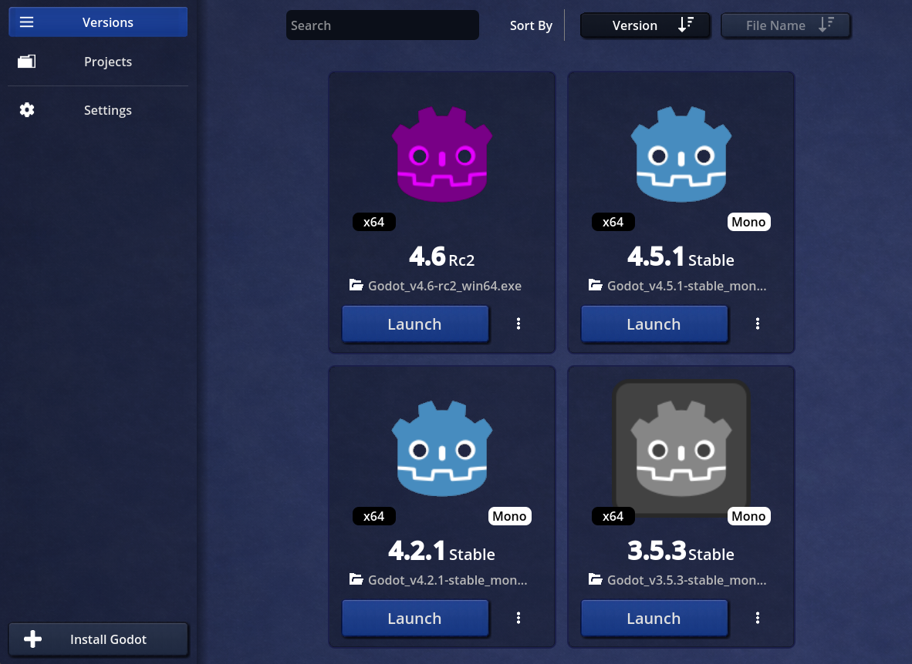
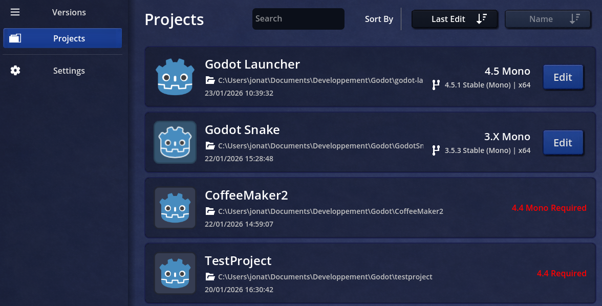
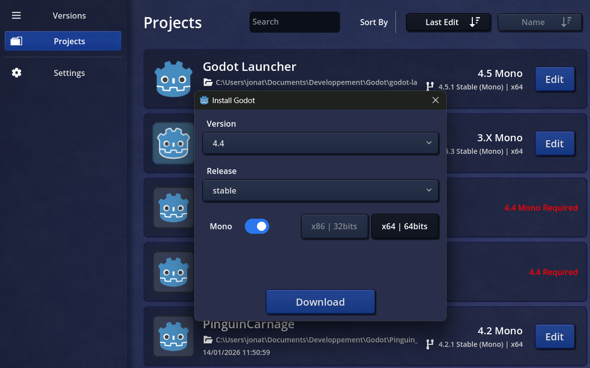
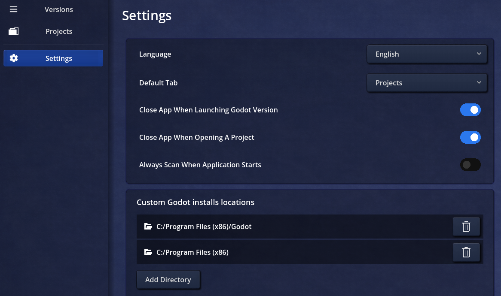

<h1 align="center">
  
   
  Godot Launcher
</h1>

Godot Launcher, is app made to facilitate managing Godot Engine versions and projects. 
It's cross platform and open source.

### Building
You need Godot Engine 4.5.1 (Mono) to build this app. 

### Download
[Download Windows build](https://raw.githubusercontent.com/shinpansen/Godot-Launcher/99fca0d14d9a57856413eb27a082f902261216e6/bin/windows/Godot_Launcher_windows_x86_64.zip)

### Support the project
It's still a work in progress. I you want to contributate, you're welcome!

### Features
# Versions
Manage your preinstalls Godot Engines versions 
1. Launch your Engines
2. Customize your icons
3. Uninstall or Hide Engine

# Projects
Manage yours projects library 
1. Edit yours projects directly in the compatible version
2. Customize your default launch version

# Downloads
You can directly download a new Godot Engine version from Launcher. 
I will be automatically extracted and installed  

# Settings
1. Language support (only english and french for now)
2. Chose directories to scan for custom godot installs and projects
3. Excluded unwanted files
... 

